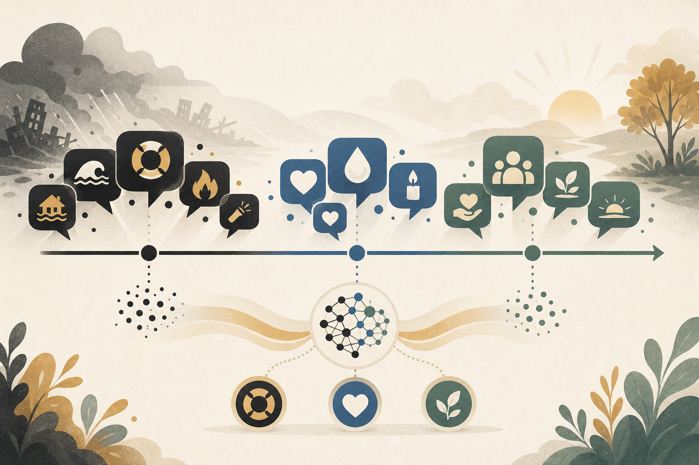

# 災害時のSNSは感情の地図だった ── 100万ツイートが教えてくれる「怒り」の正体

#AI活用 #感情AI #危機コミュニケーション #SNSモニタリング #メンタルヘルス

こんにちは。Affectosphere Group の井下です。

大規模災害が起きた翌日、SNS のタイムラインはどうなっているでしょうか。

ニュースのリポスト、救助要請、怒りのリプライ、感謝のメッセージ……混沌としているように見えて、実はそこには「感情の構造」があります。心理学では「コーピング（ストレス対処）」と呼ばれる行動パターンが、集団レベルで浮かび上がってくるのです。

2026年6月にarXivで公開された研究（Şevval Çakıcı）は、2023年2月のトルコ地震後に投稿された100万件超のトルコ語ツイートを分析し、この「集団コーピングの時系列変化」を計算的に明らかにしました。

今日の3点をまとめます。

---

## 今日の 3 点

1. 価値: 危機後のSNSには「感情の時系列パターン」があり、それはコーピング理論と整合している。
2. 「怒り」は問題解決の感情ではなく、責任帰属と意味形成の感情だった。
3. 企業・行政の広報担当者が、どのフェーズにどう介入すればよいかのヒントが見えてくる。

---

## コーピングって何？ ── 3つの対処スタイル

心理学にはストレス状況への対処（コーピング）を分類する理論があります。この研究が使ったのは次の3スタイルです。

問題焦点型（Problem-Focused Coping）は、具体的な行動で問題を解決しようとすること。「ここに救助が必要です」「支援物資の受取場所はここです」といった投稿がこれに当たります。

感情焦点型（Emotion-Focused Coping）は、感情を整理・表現することで心理的安定を保とうとすること。悲しみの共有、祈り、励まし合いのメッセージです。

意味形成型（Meaning-Making Coping）は、出来事に意味を見出そうとすること。「なぜこうなったのか」「誰の責任か」「これから何を変えるべきか」という問いかけです。

この3スタイルを、BERTurk（トルコ語専用のBERTモデル）ベースの分類器でツイートに自動的に付与し、時系列の変化を追ったのがこの研究です。

---

## 感情は時間とともに変わる ── 発災から数日間の動態

研究の核心的な発見は、「コーピングスタイルの比率が時間とともに系統的に変化する」という点です。

発災直後（緊急フェーズ）は、問題焦点型が支配的です。「生存者を助ける」「情報を共有する」という実践的行動への衝動がSNSを満たします。

しかし問題焦点型は急速に低下します。物理的な緊急事態が落ち着いてくると、「何かをする」よりも「感じる・共感する・悼む」という感情焦点型が安定的に維持されるようになります。

そして時間が経つにつれて増加するのが意味形成型です。「あの建物はなぜ倒れたのか」「政府の対応は適切だったか」「次の震災に備えて何を変えるべきか」という問いが広がっていきます。

この動態は、心理学のコーピング理論が想定する個人の心理過程とほぼ一致しています。個人の心理が、SNSという集団メディアを通じてマクロスケールで可視化されたということです。

---

## 「怒り」は問題解決の感情ではなかった

この研究で特に印象的な知見があります。

感情の中で「怒り」が最も強い相関を示したのは、問題焦点型ではなく意味形成型でした。

直感的に、怒りは「問題を解決しようとする行動的エネルギー」のように感じられます。でも実際には、怒りは「誰かを責め、出来事に意味を付与する」方向に働いていたのです。

「なぜ耐震基準を守らなかったのか」「なぜ救助が遅れたのか」「誰が責任を取るのか」──こういった投稿は、問題解決ではなく責任帰属です。そしてその責任帰属こそが、集団的な喪失（グリーフ）を社会的な問い直し（ガバナンス批判）へと昇華させる回路として機能していました。

怒りは、個人の感情表現であると同時に、社会的な意味形成のプロセスの一部だったのです。

---

## 危機広報担当者へ ── フェーズに応じた介入設計

この研究は「分析」で終わっていますが、危機コミュニケーションの現場に引き寄せると、実践的な示唆が見えてきます。

緊急フェーズ（問題焦点型が高い時期）には、情報の正確性と実用性が最優先です。「どこに行けばいいか」「何をすればいいか」という問いに即座に答えられる情報を流すことが、SNS上の集団コーピングと噛み合います。

移行フェーズ（感情焦点型が安定する時期）には、共感と連帯の表明が有効だと思います。企業が被災者に対してポジティブなメッセージを出す場合、このタイミングは比較的受け入れられやすい土壌があるでしょう。

意味形成フェーズ（怒りと意味形成型が増加する時期）には、責任や原因についての問いが増えます。この時期に「沈黙」したり「言い訳」したりする組織は、炎上しやすい。説明責任と、前向きな変革意図を示すことが求められます。

HR部門が従業員メンタルヘルス支援を設計する際も、同じフェーズ感覚が使えそうです。大規模な組織変動や危機の後、従業員の感情が「問題解決」から「感情整理」「意味形成」へと移行するタイミングに合わせた支援設計が、理論的に妥当だと言えます。

---

## 「感情の時系列」をモニタリングする組織へ

SNSモニタリングツールの多くは、感情ポジネガや言及量の増減を追います。これは重要です。でも今後は「どのコーピングスタイルが優勢か」を捉えることが、危機対応の質を変えるかもしれません。

問題焦点型が多いならば、実用的情報を。感情焦点型が多いならば、共感を。意味形成型が増えているならば、説明と変革の意図を。

このフェーズ診断を自動化する技術が成熟しつつあります。この研究はその可能性を示した一歩です。

危機は感情の地図を刻む。その地図を読む力が、組織の信頼性を左右する時代が来ているのかもしれません。

では！

---

## 参考論文

1. Şevval Çakıcı (2026). *Coping in Crisis: Computational Modeling of Coping Styles in Digital Crisis Discourse During the 2023 Turkiye Earthquake*. arXiv preprint.

<small>※ 本記事は一部 AI により執筆されており、間違った情報が含まれる恐れがあります。</small>

