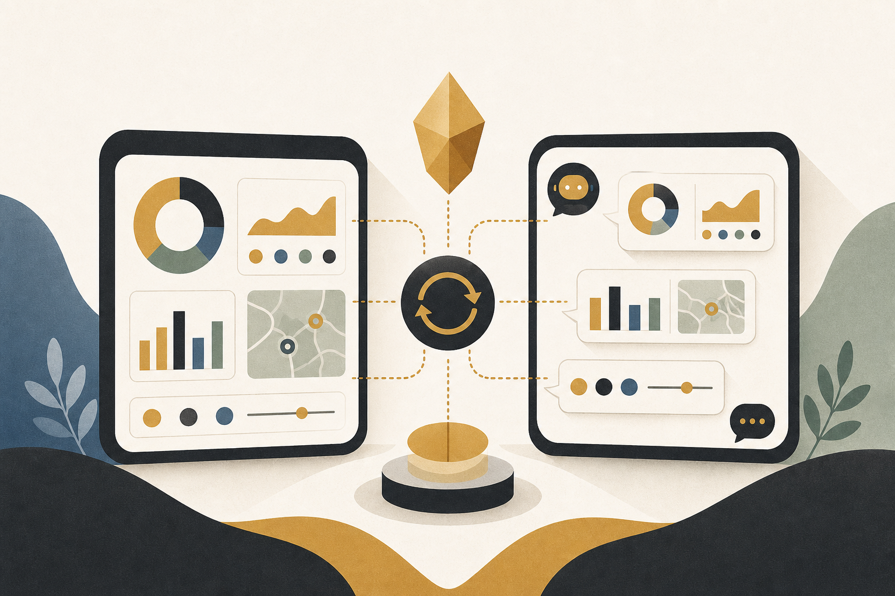

# BIダッシュボードと会話できたら、どう変わる？ ── TwinBI が示す「分析の継続性」という発想

#ビジネス #AI活用 #BI #データ分析 #DX

こんにちは。Affectosphere Group の井下です。

BIツールを使っている現場で、こういうことは起きていないでしょうか。

ダッシュボードで売上の地域別推移を確認した直後に、「じゃあ先月と比べて一番伸びた地域だけ、製品カテゴリ別にも見たい」と思ったとします。

チャットAIに質問しようとすると、今見ていた画面の情報が引き継がれない。もう一度「今月の地域別売上を」と状況を説明し直すところから始まる。この「コンテキストのリセット」が、分析の流れを止めます。

2026年6月にarXivで公開された研究（Jisoo Jang, Wen-Syan Li）は、この問題に正面から取り組んだ「TwinBI」というフレームワークを提案しています。

結論から言います。TwinBI によって、AIへのクエリの完全一致精度が43.3%から63.3%、部分一致精度が48.3%から70.8%へ向上し、タイムアウト率は40.0%から10.0%へ大幅に低下しました。

---

## 今日の 3 点

1. 課題: BIダッシュボードとチャットAIの「コンテキスト断絶」が分析の継続性を壊している。
2. TwinBI の仕組み: ダッシュボード操作ログとAIを統合インタラクションログで同期させる。
3. 現場での応用: 経営企画部門・データアナリストチームが今試せるユースケース。

---

## なぜBIとAIは「噛み合わない」のか

BIツール（Tableau、Power BI、Looker など）とチャット型AI（ChatGPT、Copilot など）はそれぞれ急速に進化しています。でも多くの組織では、この2つが「別々のウィンドウ」として存在しています。

この断絶が引き起こす問題は、表面上は「不便」に見えますが、実は分析の質に直結しています。

ダッシュボードで気づいた仮説を、AIに「今の状況から考えると」と問いかけたくても、AIはその「今の状況」を知らない。だから、ユーザーは頭の中の文脈を毎回言語化して渡し直す必要がある。この認知負荷が、深い分析への移行を妨げます。

TwinBI はこれを「ダッシュボードの操作状態とAIの状態を常に同期させる」という設計で解決しようとしています。

---

## TwinBI の仕組み ── 「統合インタラクションログ」という概念

TwinBI の核心は、ダッシュボード操作とAIクエリを同じログで管理する「統合インタラクションログ」です。

ユーザーがダッシュボードでフィルターを変えたり、グラフを切り替えたりするたびに、その操作がログに記録されます。AIは自然言語クエリを受け取った際、このログを参照して「今どんな画面を見ているか」を把握した上で応答を生成します。

論文ではこれを実現するために、3種類のアーティファクトを公開しています。

スキーマビューは、ダッシュボードが扱っているデータの構造をAIが理解できる形式で提供します。SQLクエリは、ダッシュボードの現在の表示状態を生成したクエリをAIに渡します。インサイト生成コマンドは、ユーザーの自然言語指示をダッシュボード操作のコマンドに変換します。

この3つを組み合わせることで、「ダッシュボード側の状態」と「AI側の理解」が双方向に同期します。

---

## 数字で見る改善 ── 何がどれだけ変わったか

論文が報告している精度改善を整理します。

完全一致精度（Exact Match）は43.3%から63.3%へ向上しました。これはAIが生成したSQLクエリが、正解クエリと完全に一致した割合です。約20ポイントの改善は、文脈同期の効果が明確に出ていると思います。

部分一致精度（Partial Match）は48.3%から70.8%へ向上しました。クエリが完全には一致しなくても、実質的に正しい結果を返せているケースを含む指標です。

タイムアウト率は40.0%から10.0%へ大幅に低下しました。応答が生成できずにタイムアウトになるケースが4分の1になったことは、実用性の観点で特に重要です。

加えて、ユーザビリティ評価では「状態認識メカニズム」に高い評価が集まりました。ユーザーが「AIが今何を見ているか分かる」という感覚を得られることが、信頼感につながったと考えられます。

---

## 現場で試すなら、こういうユースケースから

この研究を読んで、「自分たちの組織でどう使えるか」と考えてみました。

経営企画部門の月次レビューで試してみる場合はこんな感じです。Tableau や Power BI で月次KPIダッシュボードを確認しながら、「今見ている地域の数字、先月比でどこが外れ値か？」とAIに質問する。TwinBIのような仕組みがあれば、AIは今表示されているフィルター条件・期間・指標を把握した上で回答できます。

今の多くの環境では「先月比の外れ値を教えて」だけでは、AIはどの地域・どの指標を見ているか分かりません。これを補う説明をユーザーが毎回入力しているのが現状です。

データアナリストと非技術系マネージャーが混在するチームでも効果が大きいと思います。技術系メンバーがSQLで深掘りしたクエリ結果を、マネージャーが「この数字、昨年同期と比べると？」と自然言語で追加質問できる。コンテキストが引き継がれるので、毎回ゼロから説明する手間がなくなります。

BIツールにAI機能を追加したいITベンダーにとっても、TwinBIのアーキテクチャは参照設計として使えそうです。既存ダッシュボードの操作ログAPIにフックする形でインタラクションログを構築する実装は、現実的な開発パスに見えます。

---

## 「分析の継続性」というKPIを持てるか

BIツール導入の効果を測るKPIとして、「ダッシュボード利用率」や「レポート生成件数」は一般的です。でも「一度始めた分析が、どれだけ深く継続されたか」を測る組織は少ないと思います。

TwinBIのようなフレームワークが示しているのは、「分析の継続性」を設計するという発想です。

ツールを切り替えるたびにコンテキストがリセットされる環境では、表面的な確認で分析が止まります。コンテキストが保持される環境では、「それなら次にこれを見よう」という連鎖が起きやすくなる。

この連鎖が、意思決定の質を変えるのかもしれません。

BIとAIの統合は、単なる「便利ツールの追加」ではなく、「分析プロセスの再設計」として捉えると、組織への投資対効果がより明確に見えてくると思います。

では！

---

## 参考論文

1. Jisoo Jang, Wen-Syan Li (2026). *TwinBI: An Agentic Digital Twin for Efficient Augmented Interactions with Business Intelligence Dashboards*. arXiv preprint.

<small>※ 本記事は一部 AI により執筆されており、間違った情報が含まれる恐れがあります。</small>

