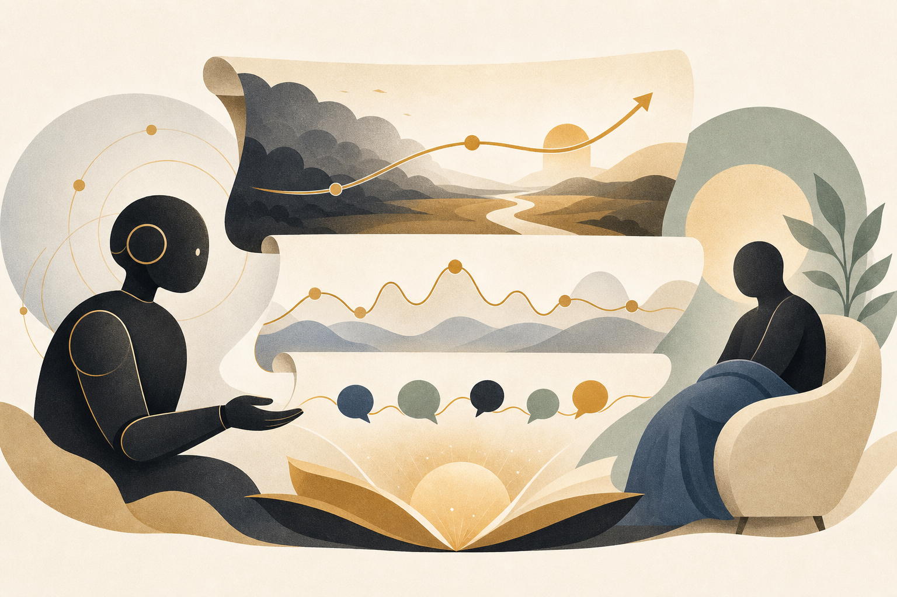

# AIが感情の揺らぎを「脚本」で制御する ── アートセラピーとLLMの意外な接点

#ビジネス #AI活用 #感情AI #メンタルヘルス #アートセラピー

こんにちは。Affectosphere Group の井下です。

「悲しみをそのまま描かせる。すると、その人は悲しみと距離を置けるようになる」。

アートセラピーの現場でよく聞く話です。

感情を「外に出す」ことで、内的葛藤が整理される。これが投影と感情的浄化という、アートセラピーの根幹にある考え方です。

でも、こう思う方も多いはずです。「それって、物語の内容次第じゃないの？」と。

感情を乱雑に揺さぶるだけでは逆効果になることもある。感情が激しすぎる場面から始まると、クライアントが物語に入れなくなる。かといって平板な物語では感情的な共鳴が起きない。

アートセラピーにおける物語は、「感情の揺らぎのデザイン」そのものです。

arXiv で公開された研究（Suqing Wang, Qinghai Miao, Chao Guo, Yisheng Lv、2606.16481）は、この「感情の揺らぎのデザイン」を AI で精密に制御する手法「EC-Script」を提案しています。

LLMエージェントが感情弧を3階層で制御し、事前に設定した感情パターンに沿った治療的ナラティブ脚本を生成します。感情一貫性で既存手法を上回るという結果が報告されています。

今日は、このEC-Scriptがどういう仕組みで動いているか、そして「感情AI×ケア」の観点でどう読めるかを整理します。

---

## 今日の3点

1. 価値: 感情弧を「全体→場面→対話」の3階層で制御することで、治療目的に合った感情の流れを持つ物語が自動生成できる。
2. EC-Scriptの3層構造: 全体方向・場面プロット・対話内局所シフト、それぞれが何をしているか。
3. 「感情AIとケア」の接点: なぜ「感情を制御した物語」が人の心に作用できるのか。

---

## ① アートセラピーと「感情弧」の関係

まず、なぜ感情弧のコントロールが重要なのかを整理します。

アートセラピーでは、クライアントが物語や絵・音楽などに自分の感情を「投影」します。そのプロセスが、内的な感情処理を助けます。

物語の場合、重要なのは「感情の道筋」です。

たとえば、「怒りを感じているクライアント」に対して設計するナラティブを考えてみてください。怒りを受け入れる場面から始まり、徐々に内省へ、最後に受容へと至る、という感情弧が必要です。

この弧が崩れると、治療効果が落ちる。物語の途中で突然「明るすぎる」展開が来ると、感情処理が中断される。逆に暗い場面が続きすぎると、クライアントが物語から離脱する可能性がある。

つまり、治療的ナラティブには「感情の設計図」が必要です。しかしそれを毎回、各クライアントの状態に合わせて手作りするのは、大変なリソースがかかります。

EC-Script はこの「感情の設計図に従った物語生成」をLLMエージェントで自動化します。

---

## ② EC-Scriptの3階層制御

EC-Scriptの核心は、感情制御を3つの階層に分けた点です。

### 第1層：全体感情方向（Global Emotional Direction）

物語全体を通じた感情の大きな方向性を決めます。

「最初は悲しみが高く、後半に向かって受容と希望が上昇する」といった、マクロな感情弧の設計です。ここでは治療目的に応じた「感情パターン」が事前に設定されます。

この層が起点になります。第1層の設計がなければ、下位の層が方向を見失います。

### 第2層：場面プロット（Scene-level Plot）

全体感情方向を受けて、各場面の感情強度と内容を具体化します。

「第2場面では悲しみを受け入れる葛藤を描く」「第4場面では内省へのきっかけとなる対話を入れる」という、中間スケールの制御です。

物語を「いくつかのシーン」に分割し、各シーンが全体の感情弧の中でどの位置にあるかを管理します。

### 第3層：対話内局所感情シフト（Intra-Dialogue Local Shift）

実際の対話・セリフレベルで、感情の細かな揺らぎを制御します。

同じ「悲しみを受け入れるシーン」でも、ある登場人物のセリフで感情が少し揺れて、次のセリフで戻る。この微細な揺らぎが、物語を「生きたもの」にします。

この層がなければ、感情が単調に推移してしまい、読み手が感情移入しにくくなります。

---

## ③ この3層設計が「感情一貫性」を保つ理由

EC-Scriptが既存手法を上回る感情一貫性を達成した、というのはどういう意味でしょうか。

通常のLLMに「アートセラピー用の物語を書いて」と依頼すると、こういうことが起きやすい。

物語の前半では悲しみを描いていたのに、中盤で突然明るい展開になる。各シーンは質が高いのに、シーンをつなぐと感情の流れが不自然になる。

これは、LLMが「今のシーン」を生成するときに、「全体の感情弧」を持続的に参照する仕組みがないことが原因です。

EC-Scriptはこの問題を、3階層の依存関係で解きます。第3層（対話）は第2層（場面）の設定を受けて動く。第2層は第1層（全体方向）の設定を受けて動く。この制約の連鎖が、全体を通じた感情一貫性を維持します。

「感情の揺らぎを精密にデザインした物語が内的葛藤の投影と感情的浄化を可能にする」というアートセラピー理論を、AIが実装するための構造的な答え、と言えます。

---

## 感情AIとケアの接点：なぜこれが重要か

この研究が面白いのは、「感情を扱う AI」の用途として、ケア・療法という領域に踏み込んでいる点です。

感情AIというと、「ユーザーの感情を読み取る」方向性の研究が多い。感情認識、感情分析、感情に応答するチャットボット。

しかし EC-Script は逆向きです。「相手の感情を制御するための感情をデザインする」。

この方向は、ケアの文脈で非常に強力な可能性を持ちます。

アートセラピーだけでなく、ナラティブセラピー、グリーフカウンセリング（悲嘆に寄り添うカウンセリング）、PTSD 治療における曝露療法のサポートなど、「感情の道筋を設計した体験の提供」が有効な領域は多くあります。

もちろん、リスクも同時に考える必要があります。感情を「制御する」AIが治療目的に使われる場合、誰が感情弧を設定するのか、クライアントの状態をどう継続的にモニタリングするのか、感情操作の倫理的境界線はどこか。これらは今後、必ず問われる問題です。この研究はその問いの起点として読む価値があります。

---

## 今日のまとめ

EC-Script は「感情弧を3階層で制御する LLMエージェント」です。

全体感情方向・場面プロット・対話内局所シフトという3層設計が、治療的ナラティブに必要な感情一貫性を実現します。

感情認識から感情デザインへ。AIがケアの文脈に入ってきたとき、「何をデザインしているのか」への解像度が上がった気がしています。

では！

---

## 参考論文

1. Suqing Wang, Qinghai Miao, Chao Guo, Yisheng Lv (2026). *Steering Emotional Dynamics for Art Therapy: Controllable Narrative Script Generation through Hierarchically Guided LLM Agents*. arXiv preprint arXiv:2606.16481.

<small>※ 本記事は一部 AI により執筆されており、間違った情報が含まれる恐れがあります。</small>

